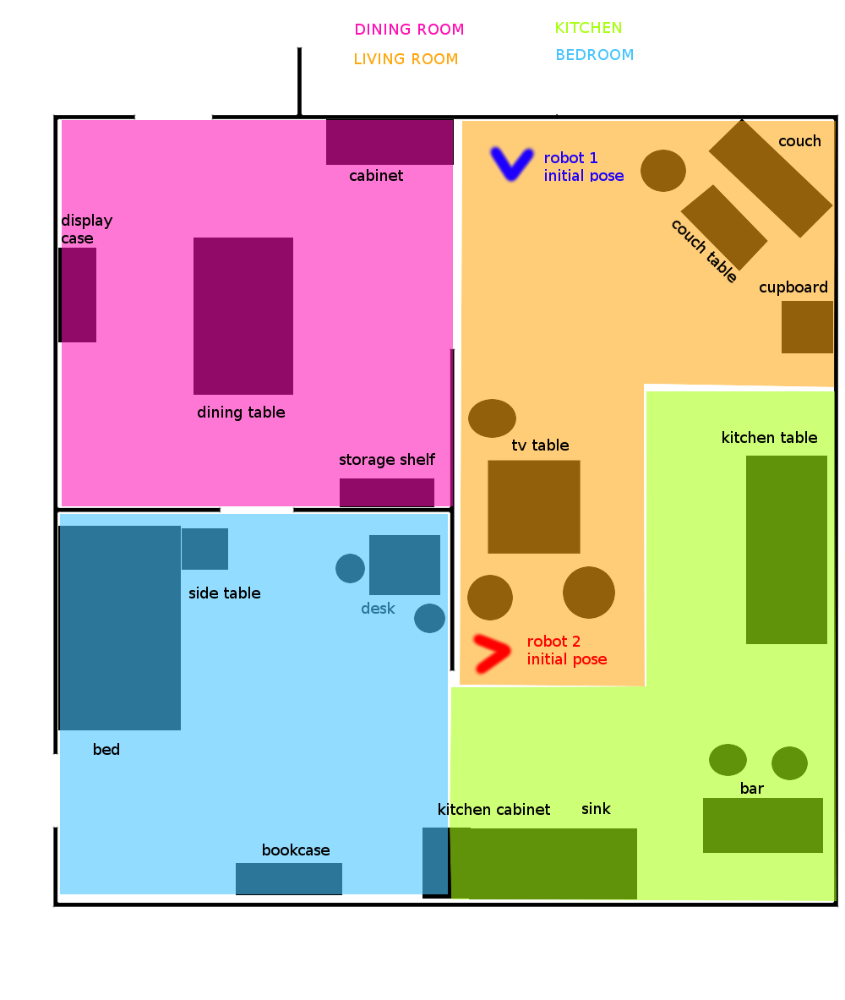
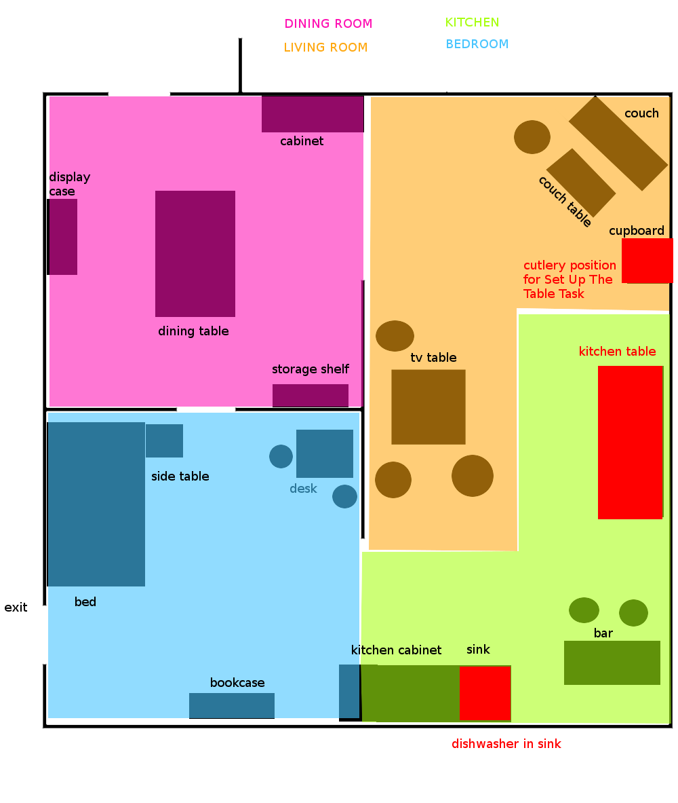

# GermanOpen2018

Data and definitions for the RoboCup@Home German Open 2018

Slides as shown on screen are available:

https://userpages.uni-koblenz.de/~raphael/rc_go_2018_orga/rc.pdf

# Scores

Scores are preliminary as of now

## Stage 1

| Team          | Speech And Person           | Poster | GPSR | Help Me Carry |Storing Groceries| Sum |
| ------------- |:---------------------------:|:------:|:----:|:-------------:|:---------------:|:---:|
| b-it bots     | 0                           | 29     | -    | -             | 0               | 29  |
| homer         | 140                         | 33     | 103  | 13            | 0               | 289 |
| ToBi          | 78                          | 36     | 16   | 30            | 0               | 160 |
| SCC           | 20                          | 31     | -    | -             | 0               | 51  |
| Tech United   | 98                          | 33     | 8    | 28            | 4               | 171 |
| Golem         | 75                          | 33     | 20   | 28            | 3               | 159 |
| Liu           | -                           | 33     | -    | -             | -               | 33  |
| IRSA          | -                           | -      | -    | -             | -               | -   |

## Stage 2

| Team          | Stage 1 | Dishwasher / Set Up The Table| EE-GPSR | Open Challenge   | Restaurant    | Sum |
| ------------- |--------:|-------------------------------:|--------:|-----------------:|--------------:|----:|
| b-it bots     | 29      | -                              | -       | -                | -             | 29  |
| homer         | 289     | 130                            | 20      | 130              | 85            | 634 |
| ToBi          | 160     | -                              | 0       | 67               | 0             | 227 |
| SCC           | 51      | -                              | -       | 48               | -             | 99  |
| Tech United   | 171     | 10                             | 0       | 63               | 50            | 294 |
| Golem         | 159     | 10                             | 0       | 70               | 10            | 249 |
| Liu           | 33      | -                              | -       | -                | -             | 33  |
| IRSA          | -       | -                              | -       | -                | -             | -   |

# Final Information

* Will be from 4th to 1st place starting at 12:00

## Testing Slots

* 09:00 Golem
* 09:20 ToBi
* 09:40 Tech United
* 10:00 homer

# Task Information Saturday

## Restaurant 

* Location could be everywhere
* Two robots at a time

### Order

* 16:00 homer & tech united
* 16:15 tobi & golem
* 16:30 scc

## Open Challenge

### Testing Slots

* 11:00 Tech United
* 11:15 Golem
* 11:30 homer
* 11:45 Serious Cybernetics Corporation
* 12:00 ToBi
* 12:15 b-it-bots

Just 15 min, but more is not possible due to schedule

### Order

* 13:00 Tech United
* 13:10 ToBi
* 13:20 homer
* 13:30 b-it bots
* 13:40 Golem
* 13:50 Serious Cybernetics Corporation

## EE-GPSR

* Two rounds:
 * Round 1 9:00 - 9:45 Robot 1: ToBi and  Robot 2:Tech United
 * Round 2 9:45 - 10:30 Robot 1: Homer and Robot 2: Golem

# Task Information Friday

## Dishwasher Test / Set up the table

* There will be no cascade pod here in German Open
* There is a dishwasher tray either in the sink (considered to be the dishwasher) 
  or on the kitchen table (when you plan to fill and then transport)
* For Set Up the Table the initial cutlery position is on the tv Table
* Provide us a menu in advance for the Set Up The Table task

## GPSR

## Help Me Carry

## Cocktail Party (SSPL only)

# Team Order

### Dishwasher / Set Up the Table

* Tech United
* Golem

### Dishwasher 

* Homer
* SCC

## GPSR

* 9:00 Tech United
* 9:10 ToBi
* 9:20 homer
* 9:30 Golem

## Help Me Carry Order

* 12:00 ToBi
* 12:05 Golem
* 12:10 Tech United
* 12:15 homer
* 12:20 Serious Cybernetics Corporation

## Robot Inspection

* 13:00 homer
* 13:05 ToBi
* 13:10 Serious Cybernetics Corporation
* 13:15 Tech United
* 13:20 b-it-bots
* 13:25 LiU@HomeWreckers

## Speech and Person Recognition

This task is divided into two rounds (after the first round you line up again in the same order):

* b-it bots
* LiU@HomeWreckers
* homer
* Tobi
* Serious Cybernetics Corporation
* Tech United

## Testing Slots

### Thursday

* 10:00 Serious Cybernetics Corporation
* 10:20 LiU@HomeWreckers
* 10:40 homer
* 11:00 ToBi
* 11:20 b-it-bots
* 11:40 Tech United

## Schedule

### Wednesday

* allday Preparation
* 18:00 Team Leader Meeting

### Thursday
* 13:00 Robot Inspection
* 16:00 Speech And Person Recognition
* 18:00 Team Leader Meeting
* 19:00 Poster Session

### Friday

* 09:00 GPSR
* 12:00 Help Me carry
* 15:00 Storing Groceries
* 17:00 Cocktail Party
* 18:00 Team Leader Meeting
* 20:00 Dishwasher Test

### Saturday

* 09:00 EE-GPSR
* 11:00 Tour Guide
* 13:00 Open Challenge
* 16:00 Restaurant
* 18:00 Team Leader Meeting

