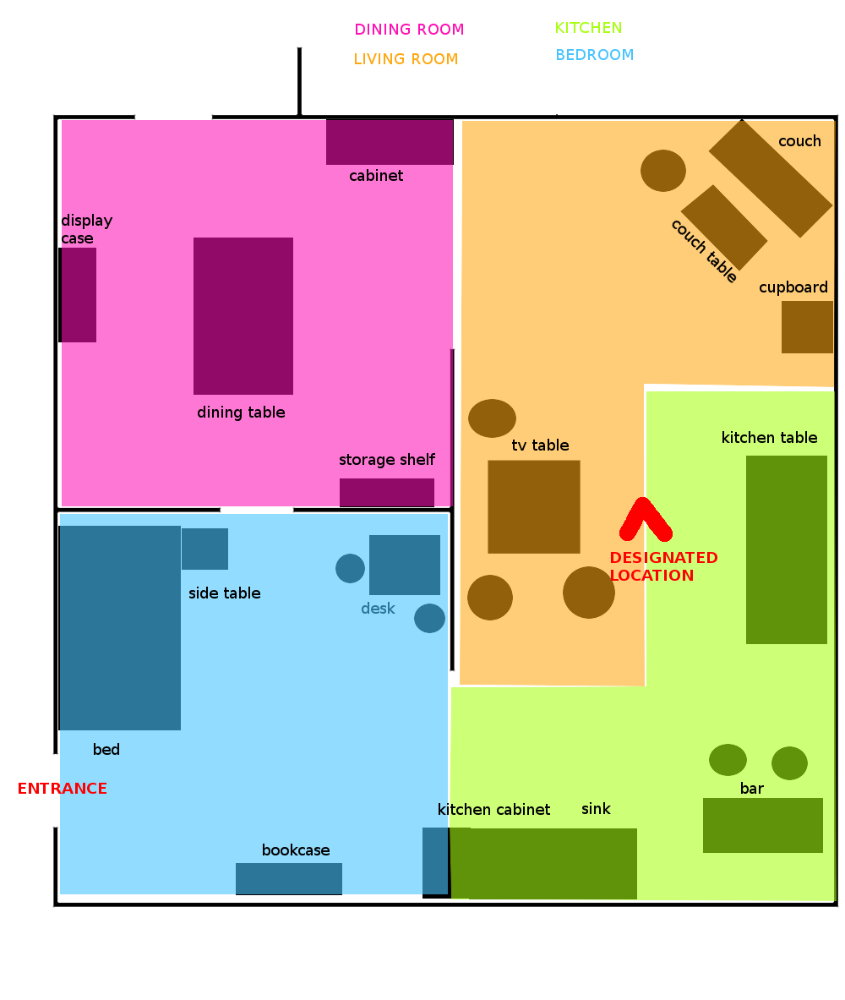
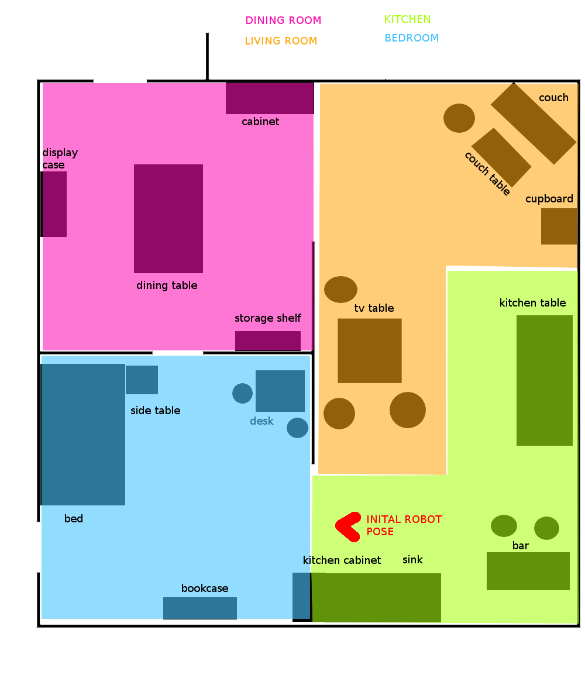
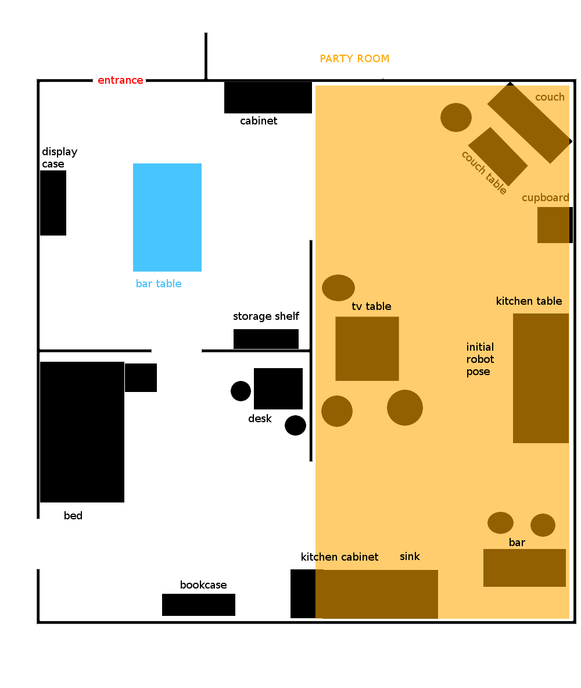

# GermanOpen2018

Data and definitions for the RoboCup@Home German Open 2018

Slides as shown on screen are available:

https://userpages.uni-koblenz.de/~raphael/rc_go_2018_orga/rc.pdf

# Scores

Scores are preliminary as of now

| Team          | Speech And Person           | Poster | GPSR | Help Me Carry | Sum |
| ------------- |:---------------------------:|:------:|:----:|:-------------:|:---:|
| b-it bots     | 0                           | 29     | -    | -             | 29  |
| homer         | 140                         | 33     | 103  | 13            | 289 |
| ToBi          | 78                          | 36     | 16   | 45            | 175 |
| SCC           | 20                          | 31     | -    | -             | 51  |
| Tech United   | 98                          | 33     | 8    | 28            | 167 |
| Golem         | 75                          | 33     | 20   | 28            | 156 |
| Liu           | -                           | 33     | -    | -             | 33  |
| IRSA          | -                           | -      | -    | -             | -   |

# Task Information Friday

## GPSR

## Help Me Carry

## Cocktail Party (SSPL only)

# Team Order

## GPSR

* 9:00 Tech United
* 9:10 ToBi
* 9:20 homer
* 9:30 Golem

## Help Me Carry Order

* 12:00 ToBi
* 12:05 Golem
* 12:10 Tech United
* 12:15 homer
* 12:20 Serious Cybernetics Corporation

## Robot Inspection

* 13:00 homer
* 13:05 ToBi
* 13:10 Serious Cybernetics Corporation
* 13:15 Tech United
* 13:20 b-it-bots
* 13:25 LiU@HomeWreckers

## Speech and Person Recognition

This task is divided into two rounds (after the first round you line up again in the same order):

* b-it bots
* LiU@HomeWreckers
* homer
* Tobi
* Serious Cybernetics Corporation
* Tech United

## Testing Slots

### Thursday

* 10:00 Serious Cybernetics Corporation
* 10:20 LiU@HomeWreckers
* 10:40 homer
* 11:00 ToBi
* 11:20 b-it-bots
* 11:40 Tech United

## Schedule

### Wednesday

* allday Preparation
* 18:00 Team Leader Meeting

### Thursday
* 13:00 Robot Inspection
* 16:00 Speech And Person Recognition
* 18:00 Team Leader Meeting
* 19:00 Poster Session

### Friday

* 09:00 GPSR
* 12:00 Help Me carry
* 15:00 Storing Groceries
* 17:00 Cocktail Party
* 18:00 Team Leader Meeting
* 20:00 Dishwasher Test

### Saturday

* 09:00 EE-GPSR
* 11:00 Tour Guide
* 13:00 Open Challenge
* 16:00 Restaurant
* 18:00 Team Leader Meeting

